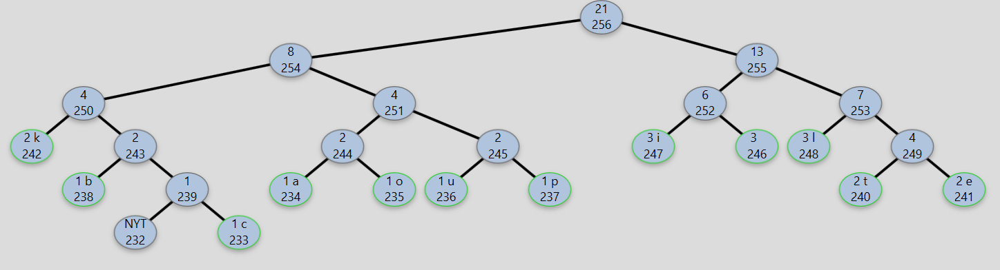
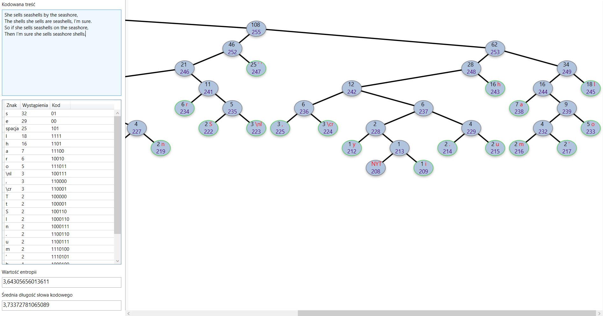

# Dynamiczne kodowanie Huffmana

Realizacja w celu kompresji danych transmisyjnych. 
Oprócz tego, że to banalny projekt, to główne cele rysują się następująco:

- [x] Rysowanie dobrze wyglądającego, dynamicznego drzewa - korzystanie z gotowych rozwiązań to pójście na łatwiznę.
- [x] Przezwyciężenie mętnej dokumentacji algorytmu

Wygląd przykładowego drzewa:

Wygląd interfejsu aplikacji prezentuje się następująco:
